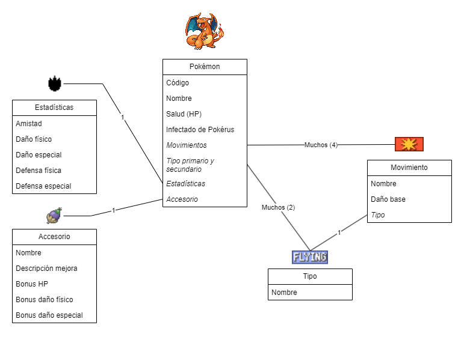
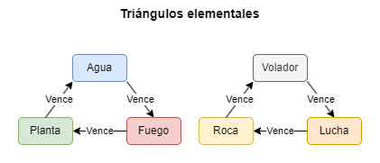
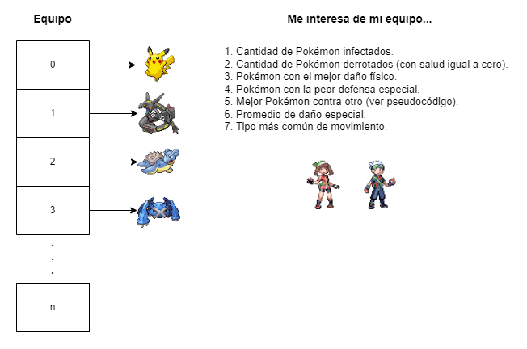

# Práctica de examen I

> Tutor Isaac Palma Medina, [CC BY-SA 4.0](https://creativecommons.org/licenses/by-sa/4.0/deed.es)
> Versión 08/09/2023


# Escenario

Tienes el emocionante desafío de crear un dispositivo de almacenamiento para Pokémon. Este ingenioso artefacto proporcionará información vital a los jugadores sobre sus Pokémon favoritos, capacitándolos para tomar decisiones más acertadas durante las batallas. La visión general de lo que los entrenadores Pokémon desean se puede apreciar en la siguiente imagen y esquema:



**Pokémon**
- `int codigo;`
- `string nombre;`
- `float salud;`
- `bool infectadoPokerus;`
- `¿? movimientos;`
- `¿? tipos;`
- `¿? estadisticas;`
- `¿? accesorio;`

**Movimiento**
- `string nombre;`
- `int dannoBase;`
- `¿? tipo;`

**Tipo**
- `string nombre;`

**Estadísticas**
- `float amistad;`
- `float dannoFisico;`
- `float dannoEspecial;`
- `float defensaFisica;`
- `float defensaEspecial;`

**Accesorio**
- `string nombre;`
- `string descripcionMejora;`
- `float bonusSalud;`
- `float bonusDannoFisico;`
- `float bonusDannoEspecial;`

# Consideraciones del Pokémon

- Cuando un Pokémon está infectado, todas sus estadísticas (excepto la amistad) y el poder de sus movimientos aumentan en un 3%.
- No puede haber Pokémon con códigos repetidos.
- Los accesorios afectan una estadística específica en un porcentaje variable.
- Cada punto de amistad incrementa la salud del Pokémon en un 0.5%.
- Únicamente existen los siguientes tipos:



# Consideraciones del equipo



**Equipo**
- `¿? misPokemon;`
- `int tamano;`
- `int cantidad;`
- `string nombreEntrenador;`

## Mejor Pokémon contra otro

> Este cálculo se realiza respecto a los tipos de los Pokémon, no respecto al tipo de los movimientos.

### Clase Pokémon

```
<Devuelve un número> soyBuenoContra(<Recibe tipo 1, Recibe tipo 2>)
	<Número> puntuacion <Igual a> 0
	<Si> mi tipo 1 vence al tipo 1 o al tipo 2 <Entonces> aumento puntuación
	<Si> mi tipo 2 vence al tipo 1 o al tipo 2 <Entonces> aumento puntuación
	<...>
	<Devolver> puntuacion
<Fin soyBuenoContra>
```
### Clase Equipo

```
<Devuelve un Pokémon> mejorContra(<Recibe Pokémon>)
	<Pokémon> mejorPokemon <Igual a> ¿?
	<Número> mejorPuntuacion <Igual a> 0
	
	<Para cada Pokémon>
		<Número> puntuacionActual <Igual a> pokemonActual->soyBuenoContra(...)
		<Si> puntuacionActual <Es mayor que> mejorPuntuacion <Entonces>
			mejorPokemon <Igual a> pokemonActual
			mejorPuntuacion <Igual a> puntuacionActual
	<Fin Para cada>
	
	<Devolver> mejorPokemon
<Fin mejorContra>
```
